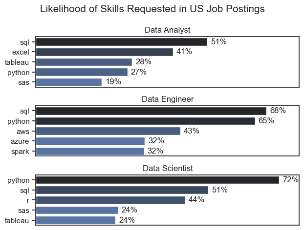
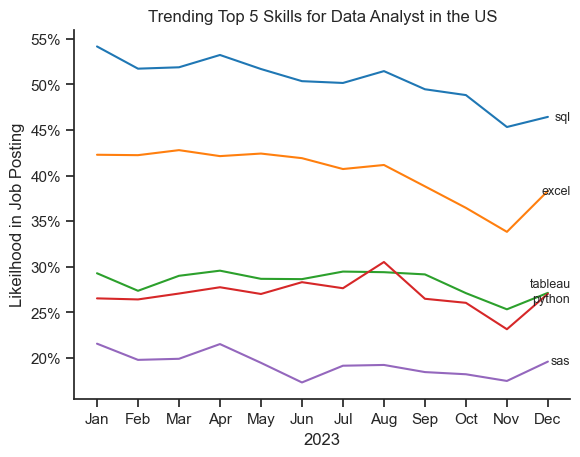
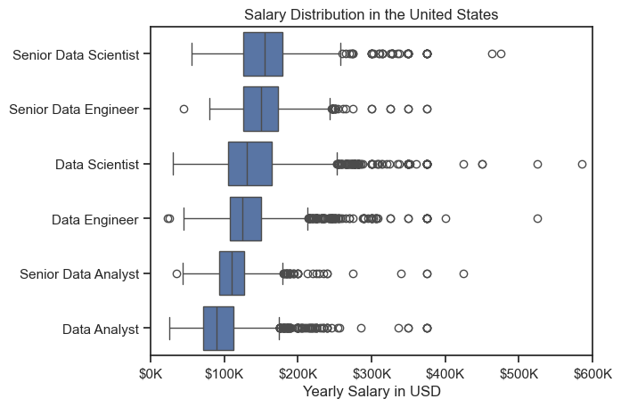
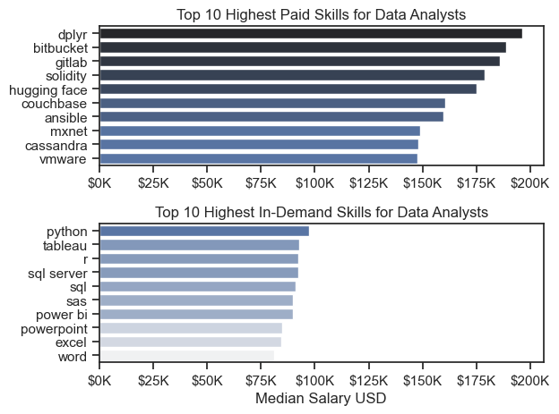
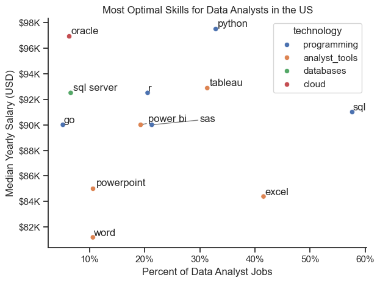

# Data Job Market Analysis: Uncovering Opportunities for Data Analysts

## Overview
This project emerged from my personal journey to understand and navigate the data analytics job market. As someone passionate about data-driven career growth, I wanted to identify what skills truly matter and how they translate into career opportunities and compensation. 

The analysis is built on he same dataset from [Luke Barousse's Python Course] that provides comprehensive information on job titles, salaries, locations, and essential skills for data roles. By leveraging this robust dataset, I've been able to extract meaningful insights about skill demand, salary trends, and optimal career paths for data analysts.

## The Questions I Explored
Through this analysis, I sought to answer these key questions:

1. **Skill Demand**: What are the most sought-after skills for the top 3 data roles?
2. **Trend Analysis**: How are in-demand skills evolving for Data Analysts over time?
3. **Compensation Insights**: How do different jobs and skills impact salaries for Data Analysts?
4. **Strategic Learning**: What are the optimal skills that combine high demand with high pay?

## Tools & Technologies
To conduct this comprehensive analysis, I leveraged:

- **Python** - Core programming language for data manipulation and analysis
- **Pandas** - For robust data cleaning, transformation, and analysis
- **Matplotlib & Seaborn** - Creating insightful visualizations and charts
- **Jupyter Notebooks** - Interactive environment for exploratory analysis and documentation
- **Visual Studio Code** - Primary development environment for script execution
- **Git & GitHub** - Version control and project collaboration

## Data Preparation Process
Before diving into analysis, I implemented a thorough data preparation workflow using Luke Barousse's dataset:

- **Data Collection**: Sourced from Luke Barousse's Python Course dataset containing job postings and market trends
- **Data Cleaning**: Handled missing values, standardized formats, and removed duplicates across job listings
- **Feature Engineering**: Created derived metrics for salary analysis, skill categorization, and demand tracking
- **Validation**: Ensured data consistency across job titles, skills, and compensation metrics


# The Analysis

## 1. What are the most demanded skills for the top 3 most popular data roles?

View my notebook with deatiled steps here: [2_Skill_Demand.ipynb](Project/2_Skill_Demand.ipynb)

### Visualize Data:

```python
fig, ax = plt.subplots(len(job_titles),1)

sns.set_theme(style='ticks')

for i,job_title in enumerate(job_titles):
    df_plot = df_skills_perc[df_skills_perc['job_title_short'] == job_title].head(5)
    sns.barplot(data=df_plot, x='skill_percent', y='job_skills', ax=ax[i], hue='skill_count', palette='dark:b_r')
    ax[i].set_title(job_title)
    ax[i].set_ylabel('')
    ax[i].set_xlabel('')
    ax[i].get_legend().remove()
    ax[i].set_xlim(0,78)

    for n, v in enumerate(df_plot['skill_percent']):
        ax[i].text(v + 1, n, f'{v:.0f}%', va='center')
    if i != len(job_title) - 1:
        ax[i].set_xticks([])

fig.suptitle('Likelihood of Skills Requested in US Job Postings', fontsize=15)
fig.tight_layout()
plt.show()
```
### Result:


### Insights:
- SQL and Python are the backbone of data roles — no matter the title, almost everyone is expected to know them.

- Data Analysts still lean on Excel, showing that hands-on, business-focused tools are just as valuable as coding skills.

- Data Engineers stand out for their cloud expertise, with AWS, Azure, and Spark reflecting the shift toward scalable, modern data systems.

- Data Scientists are the heaviest Python users, highlighting how essential it is for machine learning and analytics work.

- Each role has its own flavor — Analysts focus on visualization, Engineers build infrastructure, and Scientists dive deep into modeling and experimentation.

## 2. How are in-demand skills trending for Data Analysts?

### Visualize Data:
``` python
from matplotlib.ticker import PercentFormatter
from adjustText import adjust_text
ax = plt.gca()
ax.yaxis.set_major_formatter(PercentFormatter(decimals=0))
texts = []
for i in range(5):
    txt = plt.text(
        11.7,                    
        df_plot.iloc[-1, i],            
        df_plot.columns[i],             
        fontsize=9,
        va='center'
    )
    texts.append(txt)

adjust_text(texts, arrowprops=dict(arrowstyle='->', color='gray', lw=1))

plt.show()
```

### Results:

*Bar graph visualizing the trending top skills for data analysts in the US in 2023*

#### Insights:
- SQL is essential. It's the most requested skill by a wide margin, making it a fundamental requirement for the role.

- Python is preferred over R. For programming and statistical analysis, employers show a clear and consistent preference for Python.

- Storytelling with data is critical. High demand for Tableau and Power BI underscores the need to clearly communicate insights, not just find them.

-  Excel remains a reliable staple. It maintains a steady presence, proving its enduring value for quick analysis and universal collaboration.

- The role requires a full-stack skillset. The top skills form a complete data workflow: SQL (query), Python (analyze), and Visualization tools (present).

# 3. How well do jobs and skills pay for Data Analysts

### Salary Analysis

#### Visualize Data:
``` python
sns.boxplot(data=df_US_top6, x='salary_year_avg', y='job_title_short', order=job_order)
sns.set_theme(style='ticks')

ax = plt.gca()
ax.xaxis.set_major_formatter(plt.FuncFormatter(lambda x, pos: f'${int(x/1000)}K'))
plt.title('Salary Distribution in the United States')
plt.xlabel('Yearly Salary in USD')
plt.ylabel('')
plt.xlim(0,600_000)
plt.show()
```

#### Result:


#### Insights:
- Experience is rewarded, but specialization pays more. While advancing from a Data Analyst to a Senior Data Analyst comes with a significant pay raise, transitioning into a specialized role like Data Scientist often leads to an even higher salary, even at a non-senior level.

- The "Scientist" path leads to peak earnings. The Data Scientist role sits at the top of the pay scale, showing a clear market preference for advanced analytical, statistical, and machine learning skills. Becoming a Senior Data Scientist represents the pinnacle of earning potential for individual contributors in the analytics field.

- Behind-the-scenes engineers are the top earners. The fact that Senior Data Engineers have the highest potential salary underscores a critical insight: companies place immense value on the professionals who build robust, scalable data infrastructure, which is the foundation that all analysis depends on.

- The "Analyst" title is the career launchpad. The Data Analyst role, while essential, carries the lowest salary band. This positions it as the common and valuable entry point into the data world, where you can build foundational skills before specializing or moving into senior positions.

- There's a clear financial incentive to move beyond core analysis. The salary gap between analysis roles and engineering/scientist roles signals that the market highly rewards skills in building data products and advanced ML models, not just interpreting data.

### Highest Paid & Most Demanded Skills for Data Analysts

#### Visualize Data:
``` python
fig, ax = plt.subplots(2, 1)

sns.set_theme(style='ticks')

#Top 10 Highest Paid Skills for Data Analysts
sns.barplot(data=df_DA_top_pay, x='median', y=df_DA_top_pay.index, ax=ax[0], hue='median', palette='dark:b_r')
ax[0].legend().remove()

#Top 10 Highest In-Demand Skills for Data Analysts
sns.barplot(data=df_DA_top_skills, x='median', y=df_DA_top_skills.index, ax=ax[1], hue='median', palette='light:b')
ax[1].legend().remove()

fig.tight_layout()
plt.show()
```

#### Result:


#### Insights:
- High pay comes from niche specialties. The highest salaries are for skills like Solidity and Cassandra, which are specialized tools for blockchain and big data, not the common analyst toolkit.

- The most common skills don't pay the most. Essential tools like SQL, Excel, and Python have high demand but offer median salaries, showing that foundational skills get you the job, but niche skills get you the top pay.

- Version control is a secret weapon. Seeing Bitbucket and GitLab on the high-pay list signals that analysts who collaborate like engineers on code are highly valued and compensated for it.

- There's a clear trade-off between demand and pay. You can focus on high-demand skills for job security or master rarer skills for a premium salary, but it's difficult to have both.

- Machine learning is a lucrative path. Skills like Hugging Face and MXNet, which are used for advanced AI, command high salaries, pointing analysts toward a high-growth, high-reward career track.

# 4. What is the most optimal skill to learn for Data Analysts?

#### Visualize Data:
``` python
sns.scatterplot(
    data=df_plot,
    x='skill_percent', 
    y='median_salary', 
    hue='technology'
    )

plt.tight_layout()
plt.show()
```

#### Results:

*A Scatter plot visualizing the most optimal skills (high paying & high demand) for data analysts in the US.*

#### Insights:
- SQL is the non-negotiable foundation. It appears in the highest demand bracket, confirming that the ability to query and manipulate data is the absolute core skill expected in nearly every Data Analyst role.

- Python and Tableau are the power duo. Their strong presence shows that the modern analyst must both analyze data (Python) and effectively communicate insights through visualization (Tableau) to be valuable.

- Cloud and databases are your career accelerators. Skills like Oracle and SQL Server highlight that analysts who understand where and how data is stored are positioned for more complex, higher-impact work.

- Business communication still matters. The consistent demand for PowerPoint and Excel proves that wrapping your analysis in a clear, presentable story is just as critical as the technical work itself.

- The most valuable analysts are versatile. The ideal skillset is a blend of programming, database knowledge, visualization tools, and business software, showing that breadth of capability is highly prized.

# What I Learned

Throughout this project, I gained valuable insights into both the data analyst job market and my own technical capabilities. Here are the key takeaways:

## Technical Growth
- **Python Proficiency**: I strengthened my Python skills significantly, though I faced challenges remembering all the syntax and methods. Using Pandas for data manipulation and Seaborn/Matplotlib for visualization became more intuitive with practice.
- **Data Cleaning Mastery**: I learned that thorough data preparation is the foundation of reliable analysis. Dealing with missing values and inconsistent formats taught me the importance of data quality.
- **Visualization Techniques**: Creating clear, informative visualizations was a learning process that improved my ability to communicate data insights effectively.

## Career Insights
- **Strategic Skill Development**: The analysis revealed how to identify skills that offer the best return on investment—balancing market demand with salary potential.
- **Market Awareness**: I discovered the importance of continuously monitoring industry trends to stay relevant in the fast-evolving data field.

# Insights Discovered

The analysis uncovered several key patterns in the data job market:

- **High-Value Skills**: Technical skills like Python, SQL, and cloud technologies consistently command higher salaries, while foundational tools like Excel remain essential for most roles.
- **Demand-Salary Balance**: There's often a trade-off between highly demanded skills and top-paying skills, with niche technologies offering premium compensation.
- **Career Progression Paths**: The data shows clear pathways from entry-level analyst roles to specialized positions like Data Scientist or Data Engineer, each with distinct skill requirements and compensation levels.

# Challenges Overcome

This project presented several learning opportunities that helped me grow:

- **Syntax and Method Recall**: I frequently needed to reference documentation and previous projects to remember specific Python functions and Pandas methods, which reinforced the importance of maintaining good code references.
- **Data Quality Issues**: Handling inconsistent job titles, missing salary data, and duplicate entries required developing systematic cleaning approaches.
- **Visualization Clarity**: Creating charts that clearly communicated insights without being overwhelming was an iterative process of testing different formats and styles.
- **Analysis Scope Management**: Balancing depth versus breadth in the analysis required careful planning to ensure comprehensive coverage without getting lost in details.

# Conclusion

This deep dive into the data analyst job market has been both challenging and rewarding. While I struggled with remembering all the technical syntax, the process of constantly problem-solving and referring to documentation ultimately strengthened my Python skills and analytical thinking.

The insights gained provide a practical roadmap for skill development and career planning in data analytics. More importantly, this project demonstrated that the ability to learn and adapt—even when facing technical challenges—is just as valuable as memorizing specific tools or methods.

As the data field continues to evolve, I'm better equipped to continue learning and adapting, using the foundational analysis skills developed through this project to explore new questions and datasets in the future.


